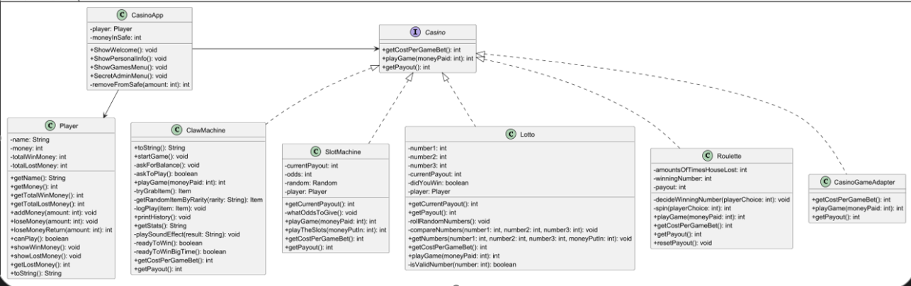

# Pay-To-Lose Casino Suite

*(Java SE 17 — Console / CLI Edition)*

## Table of Contents

* [Team](#team)
* [Introduction](#introduction)
* [Architecture](#architecture)
* [Technologies](#technologies)
* [Setup](#setup)
* [Improvements](#improvements)
* [Contributing](#contributing)
* [License](#license)
* [Disclaimer](#disclaimer)

---

## Team

| Level / Module           | Primary Owner            | GitHub                                                             | Backup Reviewer |
| ------------------------ | ------------------------ | ------------------------------------------------------------------ | --------------- |
| 1 — ClawMachine (1 €)    | **IRA Mabega**           | [https://github.com/Ira-16](https://github.com/Ira-16)             | Tamara          |
| 2 — SlotMachine (50 €)   | **Bram Labarque**        | [https://github.com/BramLab](https://github.com/BramLab)           | Richard         |
| 3 — Lotto (100 €)        | **Tamara Tomova**        | [https://github.com/Tamara060890](https://github.com/Tamara060890) | IRA             |
| 4 — Roulette (200 €)     | **Guy Richard Ibambasi** | [https://github.com/GuyRichardib](https://github.com/GuyRichardib) | Bram            |
| Core API + Menu + Player | *shared*                 | —                                                                  | —               |

> Project started **15 May 2025**.

Repository: [https://github.com/BramLab/Ervaringsweek1\_Casino](https://github.com/BramLab/Ervaringsweek1_Casino)

---

## Introduction

A training project where *“the house always wins”*—but the code stays clean and the logic is transparent.
We implement four deliberately biased casino machines and a simple user interface:

1. Greets the user, asks for their initial **budget**
2. Lets them choose a game from a **menu**
3. Updates winnings / losses until they leave or go broke

**Important note (Roulette):**
Unlike standard casino rules, our Roulette only allows bets on a single number (0–20). There are no bets on color, parity, or ranges.
After three consecutive house losses, or when the pot is almost empty, the algorithm becomes "fail-safe" and forces the player to lose until the casino recovers.

---

## Architecture

*(UML matches the project structure. See UML diagram for all class details.)*

---

## Technologies

* **Java SE 17**
* **Console (CLI) only**
* No external dependencies

---

## Setup

1. Clone the repo:
   `git clone https://github.com/BramLab/Ervaringsweek1_Casino.git`
2. Open in IntelliJ IDEA or any Java IDE.
3. Run `CasinoApp.java` as a Java Application.

---

## Improvements

* Add color, even/odd, and group bets to Roulette (not currently implemented)
* Modularize refund logic via interface method
* Add test coverage and input validation
* Improve code documentation and error handling

---

## Contributing

Pull requests welcome. Please fork the repo and make a branch for each feature or bugfix.

---

## License

This project is for educational purposes only.

---

## Disclaimer

This is a classroom project.
All games are deliberately biased.
**No real money, no gambling!**

